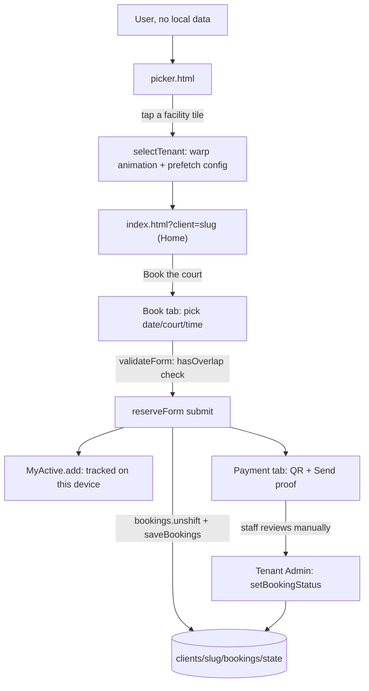
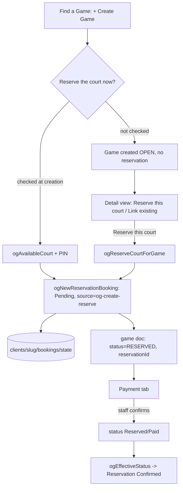
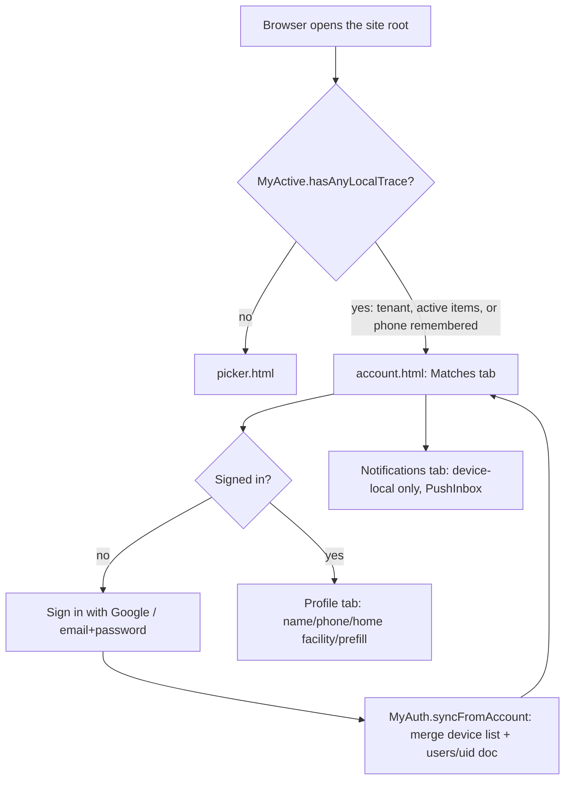
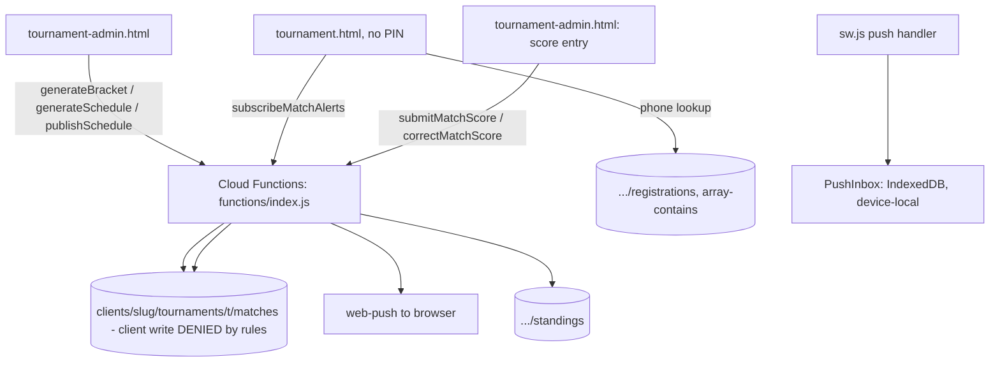
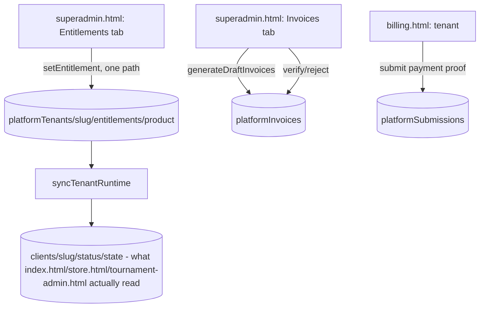

# CURRENT_ARCHITECTURE.md

**Purpose:** an evidence-based baseline of how this application actually works today, so future work (including cleanup) can be checked against it. Produced by static analysis (grep/read across the repo) plus three background research passes; no code was modified to produce this document. Where evidence is thin, that is stated explicitly rather than guessed.

**Scope note:** this is a multi-tenant Firebase app with **no traditional REST API layer**. Almost every "API call" in the flows below is a direct Firestore read/write from the browser (the whole per-tenant subtree is open to anyone who knows the tenant's slug — see §7). A small, separate set of operations that must not trust the client (tournament brackets/scores/schedule, billing) go through **Cloud Functions callables** instead. Keep this distinction in mind throughout: "API / Server Action" in this app usually means "a Firestore write with no server in the loop," not an HTTP endpoint.

---

## 1. System overview

One Firebase project (Hosting + Firestore + Storage + Functions v2 + Auth), serving a family of static HTML pages (no bundler, no framework — plain `<script>` tags, Tailwind CDN, Firebase compat SDKs). Every tenant ("facility") is a slug-scoped subtree `clients/{slug}/...`; the same static files serve every tenant, selecting which one via `?client=slug`, a remembered slug, or (rarely) a path segment.

**Runtime pages (18 top-level HTML files):**

| File | Role |
|---|---|
| `picker.html` | Facility directory / first landing page |
| `account.html` | Signed-in "My Account" (Matches / Profile / Notifications tabs) — the returning-visitor landing page |
| `my-matches.html` | Redirect stub → `account.html` (kept for old links/bookmarks) |
| `index.html` | The tenant app itself — booking, Find a Game, queue, stats, tenant Admin (537KB, by far the largest file) |
| `store.html` | Pickle Court Store (POS/inventory/reports add-on), own PIN |
| `tournament-admin.html` | Tournament organizer/staff console, reuses the tenant's Booking Admin PIN |
| `tournament.html` | Public tournament page — **no PIN, no entitlement check** (see §6) |
| `gallery.html` | Anonymous, token-gated tournament photo upload |
| `billing.html` | Tenant billing portal (PIN-gated), no in-app link found — reached only by direct URL (see §11) |
| `superadmin.html` | Platform operator console (10 tabs) |
| `ARCHITECTURE_DIAGRAM.html` | Standalone documentation page, not part of app navigation (see §11) |

**Shared client-side modules (loaded via `<script src>`, UMD-style, each also `require()`-able from Node for tests):**

| Module | Role |
|---|---|
| `my-active.js` | Cross-facility "what's active on this device" pointer list (bookings/games), the backbone of the Matches tab |
| `my-auth.js` | Optional Google / email+password sign-in, profile, account deletion, device↔account merge |
| `staff-auth.js` | **Scaffold, off by default** — staff/superadmin Google sign-in, not yet wired to real enforcement (see §11) |
| `push-inbox.js` | Device-local (IndexedDB) history of push notifications shown by the service worker |
| `pickle-ball.js` | The bouncing-ball UI easter egg / page-transition animation on picker.html |
| `next-open.js` | Shared "next open hour" calculation, used by picker.html's Continue card |
| `pickleball-scoring.js`, `court-scoreboard.js`, `motion.js` | Scoring engine, live scoreboard UI, small animation-observer helper |

**Server side:** `functions/index.js` (22 `onCall`/`onSchedule` exports) plus three non-exported helper modules it imports (`notifyRunner.js`, `tournamentCharges.js`, `engines/*.js`).

---

## 2. Major screens

Every screen found has at least one confirmed entry point and at least one confirmed Firestore/Functions dependency — **no screen was found to be entirely unreachable.** Full inventory:

| Screen | Route/File | Purpose | Entry Points | Key User Actions | Exit / Next | APIs / Services | State / Data | Status |
|---|---|---|---|---|---|---|---|---|
| Facility Picker | `picker.html` | Choose a facility (first-time landing) | Root `/` when nothing remembered; "Switch Facility"; "Browse facilities" links from My Matches card | Search, tap a tile, tap "Continue to X" | `index.html?client=slug` (optionally `#book`/`#opengames`) | `tenantDirectory` (read), `clients/{slug}/config/state` (per-tile branding) | `localStorage.cb_selected_tenant` | ACTIVE |
| My Account — Matches tab | `account.html` (`#matches`, default) | Cross-facility "what's active" for this device/account | Root `/` when something's remembered; picker's My Matches card; header account chip | View bookings/games/tournament matches, browse facilities | Facility deep-links | `MyActive` (device), `users/{uid}` (if signed in), `platformPlayers`, per-tenant `bookings`/`openGames` | Merge of device + account state | ACTIVE |
| My Account — Profile tab | `account.html` (`#profile`) | Manage identity, phone, home facility, prefill, delete account | Tab click; picker chip; `#signin` deep link | Edit fields, sign in/out, delete data/account | Stays on page | `users/{uid}` | Signed-in only; sign-in also merges Matches data | ACTIVE |
| My Account — Notifications tab | `account.html` (`#notifications`) | Device-local push-alert history | Tab click | View past alerts | Stays on page | `push-inbox.js` (IndexedDB only — never Firestore) | Device-only, confirmed never synced | ACTIVE |
| Tenant Home / Book / Find a Game / Payment / Queue / Stats / Bookings / Admin | `index.html` (hash-routed) | The core tenant app — booking, matchmaking, staff console | `?client=slug` from picker/account/direct link | Book a court, create/join a game, pay, manage queue, staff Admin PIN unlock | Payment tab, Admin unlock, or back Home | Direct Firestore (`clients/{slug}/**`), no Cloud Functions | `bookings`/`openGames`/`courts`/`staffReserve`/etc. | ACTIVE |
| Store | `store.html?client=slug` | POS / inventory / reports add-on | "Go to Store →" from tenant Admin; "Open Store ↗" from superadmin | Ring up a sale, adjust stock, open/close shift, view reports | Stays on page (tabbed) | Direct Firestore only, own PIN (`storeSettings/state`) | `storeProducts`/`storeSales`/`storeInventoryLog`/`storeShifts` | ACTIVE (gated by `storeEnabled`/`storePaused`) |
| Tournament Admin | `tournament-admin.html?client=slug` | Organizer console — divisions, registration, scheduling, scoring, gallery moderation | "Go to Tournaments →" from tenant Admin; "Open Tournaments ↗" from superadmin | Create tournament, generate bracket/schedule, enter scores, moderate photos | Public tournament page (view link) | Direct Firestore + Cloud Functions callables (bracket/schedule/score mutations) | Reuses tenant Booking Admin PIN | ACTIVE (gated by `tournamentEnabled`/`tournamentPaused`) |
| Public Tournament page | `tournament.html?client=slug&t=id` | Player-facing schedule/standings/live scores/photo gallery, no PIN | Tenant Home tile; Tournament Admin "View Public Page"/copy-link; push-notification payload URLs; My Account Matches tab | Look up "my matches" by phone, subscribe to alerts, keep score, view gallery | Stays on page | Direct Firestore (open reads) + Cloud Functions (`setLiveScore`, `proposeMatchResult`, `subscribeMatchAlerts`) via raw `fetch` | None gated — deliberately public even if the add-on is later paused | ACTIVE |
| Gallery Upload | `gallery.html?client=slug&t=id&token=...` | Anonymous, token-gated tournament photo upload | Only via a token link generated in Tournament Admin's Gallery panel | Pick/upload photos | "Thanks!" confirmation | Firestore (`uploadTokens`, `photos`) + Storage (no auth check — rules explicitly call this "the one truly open-to-the-internet upload surface") | Token doc tracks usage cap | ACTIVE |
| Tenant Billing Portal | `billing.html?client=slug` | Tenant views its own invoices/payment status, submits payment proof | **No in-app link found** — direct URL only | View invoices, submit a payment claim | Stays on page | `getBillingPortalData` Cloud Function (PIN-verified server-side); writes `platformSubmissions` | Own PIN check (server-verified) | ACTIVE, but see §11 (unclear entry point) |
| Superadmin Console | `superadmin.html` (10 tabs) | Platform-operator control plane | Direct URL, sign-in gated | Manage tenants/entitlements/plans/invoices/reports/diagnostics/feature ideas/audit | Stays on page (tabbed) | Direct Firestore + 2 Cloud Functions callables (`syncTournamentCharges`, `setTournamentChargeOverride`) | `platformTenants`, `platformPlans`, `platformInvoices`, etc. | ACTIVE — all 10 tabs confirmed fully wired |
| Architecture Diagram (doc) | `ARCHITECTURE_DIAGRAM.html` | Standalone documentation page | None found — no in-app link | Read-only | N/A | N/A | N/A | UNREFERENCED — documentation artifact, not app navigation |

---

## 2a. Screen → Process Matrix

*"What actual process does this screen trigger underneath?"*

| Screen | User Action | Frontend Logic | Process Invoked | Business Logic | Data Change | Next State |
|---|---|---|---|---|---|---|
| Book the court | Submit reservation form | `validateForm()` → `hasOverlap()` | Direct Firestore write | Staff-hours + open-play + booking conflict check | `clients/{slug}/bookings/state` (array append) | Payment tab (Pending) |
| Find a Game — Create | Submit with "reserve court" checked | `ogAvailableCourt()` | Direct Firestore write (game + booking together) | Availability check, shared booking builder | New `openGames/{id}` doc + `bookings/state` append | Payment tab |
| Find a Game — detail, "Reserve this court" (no reservation yet) | Submit reserve form | `ogReserveCourtForGame()` | Direct Firestore write (update existing game) | Same shared builder as creation-time | Existing `openGames/{id}` updated + `bookings/state` append | Payment tab |
| Find a Game — detail, "Link existing" | Pick booking, enter PIN | `ogLinkReservation()`/`ogCheckLink()` | Direct Firestore write | PIN match against an already-confirmed booking | `openGames/{id}.reservationId` set | Detail view refresh, queue created |
| Tournament Admin — Generate Bracket | Click "Generate Bracket" | `callEngine('generateBracket', ...)` | **Cloud Function** `generateBracket` | Round robin / single elim / group+knockout via `engines/*.js` | New `matches` docs, `standings` doc | Matches & Standings view |
| Tournament Admin — Enter Score | Submit score | `callEngine('submitMatchScore', ...)` | **Cloud Function** `submitMatchScore` | "Only writer of match completion/standings/advancement" | `matches/{id}`, `standings`, possibly new next-round match | Standings/bracket updates live |
| Public Tournament — Subscribe to alerts | Tap "Get alerts" | `callFn('subscribeMatchAlerts', ...)` (raw fetch) | **Cloud Function** `subscribeMatchAlerts` → `notifyRunner.registerSubscription` | Matches subscriber to registration by phone | `pushSubs/{id}` created | Push notifications begin arriving |
| My Account — Sign in | Tap "Sign in with Google" | `MyAuth.signIn()` | Firebase Auth + Firestore | Merge device list with account (`mergeActive`) | `users/{uid}` created/updated, device `MyActive` list updated | Matches tab re-renders with merged data |
| Superadmin — Grant entitlement | Toggle a product on for a tenant | `setEntitlement()` | Direct Firestore write | Single consolidated entitlement-mutation path | `platformTenants/{slug}/entitlements/{product}`, then mirrored via `syncTenantRuntime()` | `clients/{slug}/status/state` updated |
| Superadmin — Generate invoices | Click "Generate Draft Invoices" | `generateDraftInvoices()` | **Cloud Function** `syncTournamentCharges`, then direct Firestore | Usage-ledger-derived frozen line items | New `platformInvoices/{id}` docs | Invoices tab, `draft` status |

---

## 2b. Process → Screen Matrix

*The reverse: for each significant backend/business process, which screens depend on it.*

| Process / Service | Triggered By | Screens Depending On It | Function/API | Data Sources | Side Effects |
|---|---|---|---|---|---|
| `hasOverlap` / `isStaffBlocked` (conflict check) | Any booking or reservation attempt | Book the Court, Find a Game (both reserve paths) | Client-side function in `index.html` | `bookings/state`, `openPlay`, `staffReserve` | Blocks the write client-side; no server enforcement |
| `ogEffectiveStatus` family (status derivation) | Every render of a Find-a-Game game | Find a Game list/detail (`index.html`), My Account Matches tab (`account.html`, duplicated copy) | Pure client function, not persisted | `openGames` doc + linked `bookings` doc | Display label only ("Reservation Pending" vs "Confirmed", EXPIRED) |
| `MyActive.hasAnyLocalTrace()` | Page load at root `/` | `index.html` (root redirect decision), `picker.html` (My Matches card + Continue-card home-facility), `account.html` (empty-state logic) | `my-active.js` | `localStorage` only | Decides picker.html vs account.html |
| `generateBracket`/`advanceToKnockout`/`submitMatchScore`/`correctMatchScore` (Cloud Functions) | Organizer actions | `tournament-admin.html` only (writer); `tournament.html` (reader, live) | `functions/index.js` | `matches`, `divisions`, `registrations`, `standings` | Rules deny ALL client writes to these paths — Functions are the only writer |
| `scheduleMatch` (legacy) vs `generateSchedule`/`moveMatch` (Cloud Functions) | Organizer scheduling actions | `tournament-admin.html` | `functions/index.js` | `matches.sched` / `matches.{court,scheduledDate,scheduledHour}`, `bookings/state` | Two parallel data shapes on the match doc (see `LEGACY_CANDIDATES.md` §2) |
| `tournamentNotifier` (cron, every 1 min) | Cloud Scheduler | None directly — delivers to whichever device is subscribed | `functions/notifyRunner.js` | `platformLiveTournaments`, `pushSubs`, `notifyOutbox` | Browser push notification; `sw.js` also records it into device-local `PushInbox` |
| `setEntitlement()` (single mutation path) | Superadmin Entitlements tab actions | `superadmin.html` (writer); `index.html`/`store.html`/`tournament-admin.html` (readers of the mirrored result) | Direct Firestore | `platformTenants/{slug}/entitlements/{product}` → mirrored to `clients/{slug}/status/state` | Gates Store/Tournaments access everywhere |
| Three billing-formula paths (§3 in Legacy Candidates) | Superadmin Provisioning / Plans / Directory tabs | `superadmin.html` only | Direct Firestore | `platformTenants/{slug}.billing`/`.subscription` | No single canonical writer, unlike entitlements |

---

## 3. Major user journeys

### Journey A — First-time visitor picks a facility and books a court

Evidence: `index.html` `reserveForm` submit handler (`newBooking` object, `saveBookings`), `hasOverlap()`/`isStaffBlocked()` conflict check, `MyActive.add` call, Payment tab (`PAY_CTX`, `renderPayContext`), `setBookingStatus()` in the tenant Admin console.

### Journey B — Organizer creates a Find a Game game and reserves a court (two entry points, one ending)

Evidence: `index.html` — `ogAvailableCourt`, `ogNewReservationBooking` (the single shared builder), `ogReserveCourtForGame`, `ogLinkReservation`, `ogEffectiveStatus`/`ogReservationAwaitingPayment`/`ogReservationExpired`, `ogEnsureLinkedQueue`.

### Journey C — Returning visitor with a signed-in account

Evidence: `index.html` root-route block (`_isReturningVisitor` → `MyActive.hasAnyLocalTrace()`), `account.html` tab logic, `my-auth.js` (`syncFromAccount`, `mergeActive`, `saveProfile`), `push-inbox.js` (explicitly never touches Firestore).

### Journey D — Tournament: organizer sets up, player finds their matches, scores flow through Functions

Evidence: Cloud Functions research pass — `functions/index.js` exports; `firestore.rules` explicitly denies client writes to `matches`/`standings`/`live`/`proposals` (server-only, per rules comment); `tournament.html` confirmed to have **no PIN and no entitlement check** by design (its own code comment, tournament.html:93-100).

### Journey E — Platform operator manages a tenant's entitlements and billing

Evidence: superadmin.html research pass — `setEntitlement()` as the single entitlement-mutation path (superadmin.html:705), `syncTenantRuntime()` mirroring into `clients/{slug}/status/state`, `billing.html` writing `platformSubmissions`.

---

## 4. Navigation architecture

- **Tenant resolution** (`index.html`, `getCurrentTenant()`): (1) `?client=` query param — wins, also persists to `localStorage.cb_selected_tenant`; (2) that localStorage value; (3) first path segment, unless it's a reserved word (`app|picker|superadmin|store|tournament-admin|tournament|gallery|my-matches|account`); (4) **subdomain-based resolution is explicitly present in the code but disabled** — a real, currently-inert code path, not a stub (see §11).
- **Root route** (`index.html`, lines near the top): at `/` with no `?client=`, redirects to `account.html` if `MyActive.hasAnyLocalTrace()` (a remembered tenant, tracked bookings/games, or a remembered phone), else to `picker.html`. This is the one piece of "routing logic" in the whole app that isn't a plain link.
- **Switch Facility**: `index.html`'s header button clears `cb_selected_tenant` and goes straight to `/picker.html` (deliberately not `/`, so it can't bounce back to `account.html`).
- **In-page navigation** inside `index.html` is hash-based (`#book`, `#opengames`, `#payment`, etc.), read once on load and via `popstate` — there is no client-side router library; `routeTo(id)` just toggles view visibility and updates the hash.
- **Cross-page links** are almost all plain `<a href>` / `window.location.href` with `?client=` (and sometimes `&t=` for a specific tournament, or `#hash` for a sub-view), not a SPA transition — except the picker→facility "warp" animation (`pickle-ball.js`), which is cosmetic (prefetches config, then does a real navigation).
- **PIN gates are per-product, not unified**: tenant Admin (`index.html`) and Tournament Admin (`tournament-admin.html`) share one PIN (`clients/{slug}/settings/state`); Store has its **own, separate** PIN (`clients/{slug}/storeSettings/state`) — explicitly documented in `store.html` as intentionally different from the Booking Admin PIN; the public `tournament.html` and `gallery.html` have no PIN at all, by design.
- **`staff-auth.js` (scaffold)**: an alternate Google-sign-in path into the same Admin PIN modal, gated behind `STAFF_GOOGLE_ENABLED = false` or a `?staffgoogle=1` query override. Today it can only ever be an *additional* way in (`'pin-or-google'` mode) — nothing currently switches it to replace the PIN.

---

## 5. Business processes (the non-trivial ones, not simple CRUD)

| Process | Where it lives | Trigger | What makes it non-trivial |
|---|---|---|---|
| Booking conflict detection | `index.html`: `hasOverlap`, `isStaffBlocked`, `getEffectiveStaffHours` | Every booking/reservation attempt | Merges a weekly staff-block template with per-date overrides, plus open-play blocks, plus other bookings — all client-side, no transaction |
| Reservation-status derivation | `index.html` / `account.html`: `ogEffectiveStatus`, `ogReservationExpired`, `ogReservationAwaitingPayment` | Every render of a Find-a-Game game | Purely derived (never written back) — RESERVED + unpaid + >1h old reads as EXPIRED; RESERVED + still-Pending reads as "Reservation Pending" vs "Confirmed". Duplicated verbatim in `account.html` (kept in sync by a test, see §11) |
| Cross-device My Matches sync | `my-active.js` + `my-auth.js` | Sign-in, `MyActive.save()` | Merge-not-overwrite union of device list + `users/{uid}.active`, keyed by `(clientId,kind,refId)`, newest `addedAt` wins |
| Tournament bracket generation / advancement | `functions/index.js`: `generateBracket`, `advanceToKnockout`, `submitMatchScore` | Organizer action in `tournament-admin.html` | Server-only (rules deny client writes to `matches`/`standings`); single-elim/round-robin/group+knockout share `engines/*.js` |
| Tournament scheduling (TWO coexisting implementations) | `functions/index.js`: `scheduleMatch` (legacy, per-court) vs `generateSchedule`/`moveMatch` (venue-aware) | `tournament-admin.html`, branches on `venuesConfigured()` | Both are live and reachable today — a real duplicate-implementation-of-one-feature, not dead code (see §10/§11) |
| Push-alert delivery + device-local history | `functions/notifyRunner.js` (server) + `sw.js`/`push-inbox.js` (client) | `tournamentNotifier` cron (every minute) | Delivery (server, Firestore-backed registry) and "did I see this" history (client, IndexedDB-only) are deliberately two separate stores that never sync with each other |
| Platform billing (manual, no payment processor) | `functions/index.js` + `superadmin.html` + `billing.html` | Monthly draft generation, tenant payment-proof submission, superadmin verification | Draft → awaiting_payment → submitted_for_verification → verified/rejected/partially_paid/waived/cancelled, **never auto-verified**; three parallel ways to adjust a tenant's billing formula/credit exist (see §11 F3/F4) |

---

## 6. API / service architecture

There is no conventional REST API. Two access patterns coexist:

1. **Direct Firestore** (the default): `clients/{slug}/**` is readable/writable by anyone who can format a valid-looking slug (`isValidTenantId()` in `firestore.rules` — no auth check at all). This is a deliberate trust model documented repeatedly in the rules file's own comments ("no user auth in this app to gate on further").
2. **Cloud Functions callables** (the exception, used specifically where client trust isn't acceptable): tournament match/schedule/standings mutations, push-alert subscribe/unsubscribe, the two platform-billing recalculation callables, and the tenant billing-portal read (`getBillingPortalData`, which explicitly exists to close a prior data-exposure gap — see its own header comment in `functions/index.js`).

All 22 callables were confirmed to have at least one real client caller (or be a scheduled cron with no caller by design) — **no orphaned Cloud Function was found.**

Region: all callables and the client's callable factory agree on `asia-southeast1` (confirmed in both `functions/index.js` and every caller). `tournament.html` deliberately calls Functions via raw `fetch()` instead of the Functions SDK (it doesn't load `firebase-functions-compat.js`), unlike every other caller (`tournament-admin.html`, `billing.html`, `superadmin.html`), which do use the SDK's `httpsCallable`. This is a real (minor) inconsistency, not an error — both reach the same endpoints correctly.

---

## 7. Data flow and state

- **Firestore data shape is inconsistent by design in one specific way**: most "list" data is one-doc-per-collection (`openGames`, `tournaments`, `matches`, `registrations`, ...), but `bookings`, `openPlay`, `courts`, `pricing`, `staffReserve`, and `storeProducts` are each a **single document holding a whole array** (`clients/{slug}/{collection}/state`, `{data: [...]}`), read/written wholesale via `fbSave`/`fbLoadCache` in `index.html`. This is documented in-code as a real concurrency ceiling, not an oversight, but it means two people booking at the exact same moment race on a single document rather than being naturally serialized like the array-collections are.
- **Two parallel "is this tenant online" fields exist by design**: `platformTenants/{slug}.lifecycle` (new, authoritative, superadmin-managed) and the same doc's `.status` plus `tenantDirectory/{slug}.status` (old boolean, kept mirrored by `syncTenantRuntime()` specifically because `picker.html` and reporting still read the old field). This is the clearest "OLD FLOW / REPLACED BY / NEW FLOW, both still present" pattern found in the app (see §11 and `GAP_ANALYSIS.md`).
- **Entitlement flags**: `storeEnabled`/`storePaused`/`tournamentEnabled`/`tournamentPaused` live on `clients/{slug}/status/state` (derived/mirrored, superadmin-writable only per rules) and are the ONLY thing tenant apps actually read to gate Store/Tournaments — confirmed identical field names across `index.html`, `store.html`, `tournament-admin.html`. The richer `platformTenants/{slug}/entitlements/{product}` lifecycle documents (trial/active/suspended/...) are the platform's own source of truth; tenant apps never read them directly.
- **Device-local vs account-synced vs tenant-shared state**, three genuinely different scopes coexist in the same browser:
  - Device-only, never synced anywhere: the push-notification inbox (`push-inbox.js`, IndexedDB) — explicit design choice, labeled as such in the UI.
  - Device-local but account-syncable: `MyActive`'s tracked-items list, and the remembered tournament-lookup phone number — synced to `users/{uid}` only if signed in.
  - Tenant-shared (the "real" data): bookings, games, tournaments, etc., under `clients/{slug}/...`.

---

## 8. External integrations

- **Firebase**: Hosting, Firestore, Storage, Auth (Google + email/password providers), Functions v2 (region `asia-southeast1`), Cloud Scheduler (`onSchedule`).
- **Web Push** (`web-push` npm package, server-side) + browser Push API (client-side, `sw.js`) — VAPID keys via `defineSecret`. No third-party push service (e.g. FCM-as-a-product, OneSignal) — this is raw Web Push.
- **No payment processor** — billing is explicitly manual (QR code + human verification), confirmed in multiple places (`platformSubmissions` comments, `billing.html`).
- **Google Fonts / CDN-hosted Firebase compat SDKs** — static asset dependencies only, no data flow.
- **No SMS/email provider found** — phone numbers are used only as an identity key (`platformPlayers/{phone}`), never for sending anything; there is no evidence of an SMS gateway in `functions/package.json` (only `firebase-admin`, `firebase-functions`, `web-push`).

---

## 9. Important dependencies (cross-cutting, easy to miss)

- `my-active.js` is loaded by **three** pages (`index.html`, `picker.html`, `account.html`) and is the single source of truth for "what counts as a returning visitor" via its `hasAnyLocalTrace()` — a change here affects root-routing on all three.
- `ogNewReservationBooking()` (in `index.html`) is the one shared booking-builder for **both** "reserve at game creation" and "reserve after the fact" — intentionally consolidated this session specifically to avoid a second copy.
- `ogEffectiveStatus`/`ogReservationExpired`/`ogReservationAwaitingPayment` are **duplicated** (not shared) between `index.html` and `account.html`, because `account.html` has no access to `index.html`'s inline script scope. A dedicated test (`tests/account.test.js`) asserts the two copies' function bodies stay logically identical — this is a monitored, not silent, duplication.
- `firestore.rules`'s per-tenant `isValidTenantId(clientId)` open-write pattern underlies almost everything in §6 — any tightening there is a blast-radius-maximal change (see `LEGACY_CANDIDATES.md`).
- The Cloud Functions region string (`asia-southeast1`) is repeated in four separate client files rather than centralized — a deployment-config dependency, not a bug, but worth knowing before ever changing region.

---

## 10. Known architectural inconsistencies (fact, not yet judged good/bad)

1. Two scheduling systems for tournament matches coexist and are both live (`scheduleMatch` vs `generateSchedule`/`moveMatch`).
2. Three different code paths can change a tenant's billing formula in `superadmin.html`, with no single canonical mutation function (unlike entitlements, which do have one: `setEntitlement()`).
3. Three different code paths can adjust a tenant's credit balance; one of them (`data-apply-charge`) writes no invoice at all, bypassing the entire invoice/audit trail the other two are built around.
4. A documented staff permission (`manage_entitlements` / `manage_organizations` / `diagnose_access`) appears, on inspection, to require the raw `superadmin` claim at the Firestore-rules layer for one specific write (`clients/{slug}/status/state`) — a possible functional bug for any real (non-owner) scoped staff account. **Not yet runtime-verified.**
5. `platformTenants/{slug}.status` (old) and `.lifecycle` (new) are both live and intentionally kept in sync — a real "old and new coexist" pattern, not accidental leftover.
6. `staff-auth.js` exists fully wired into `index.html` and `superadmin.html`'s login screens but is switched off (`STAFF_GOOGLE_ENABLED = false`) — a shipped-but-dormant feature, not a legacy one (it's the newest code in the repo).

---

## 11. Legacy candidates (summary — full table in `LEGACY_CANDIDATES.md`)

- **`firestore.rules` bottom section** ("Legacy single-tenant structure... WARNING: should be removed") — self-labeled, confirmed zero client callers anywhere in the repo, still live and wide open. Highest-confidence cleanup candidate found.
- **`ARCHITECTURE_DIAGRAM.html`** — standalone doc page, zero in-app references. Not dead *code* (nothing calls it, but nothing was ever supposed to); likely superseded by this very document going forward.
- **`billing.html`** — active, tested, PIN-gated, but no `<a href="billing.html">` found anywhere in the app. Either reached by a direct link given out-of-band, or a genuinely missing in-app entry point.
- Two misplaced HTML section comments (`store.html`, `tournament-admin.html`) — cosmetic documentation drift from a past tab reordering, zero functional impact.
- A duplicate `platformAuditLog` write on one tenant-suspend button in `superadmin.html` — a small, likely-accidental bug, not a legacy artifact.

---

## 12. Unknowns requiring runtime verification

- Whether a real (non-superadmin-claim) staff account with only `manage_entitlements`/`manage_organizations`/`diagnose_access` can actually perform those actions today, given the `firestore.rules` mismatch noted in §10.4.
- Whether `billing.html` is actually reached by any current tenant, and how (out-of-band link? Never used?).
- Whether the legacy `firestore.rules` block (§11) is truly unreferenced by anything outside this repo (e.g., an old mobile client, a partner integration) — static analysis can only confirm nothing *in this repo* calls it.

See `LEGACY_CANDIDATES.md` for the full evidence-based classification, dependency/blast-radius analysis, and a proposed verification + cleanup sequence.
